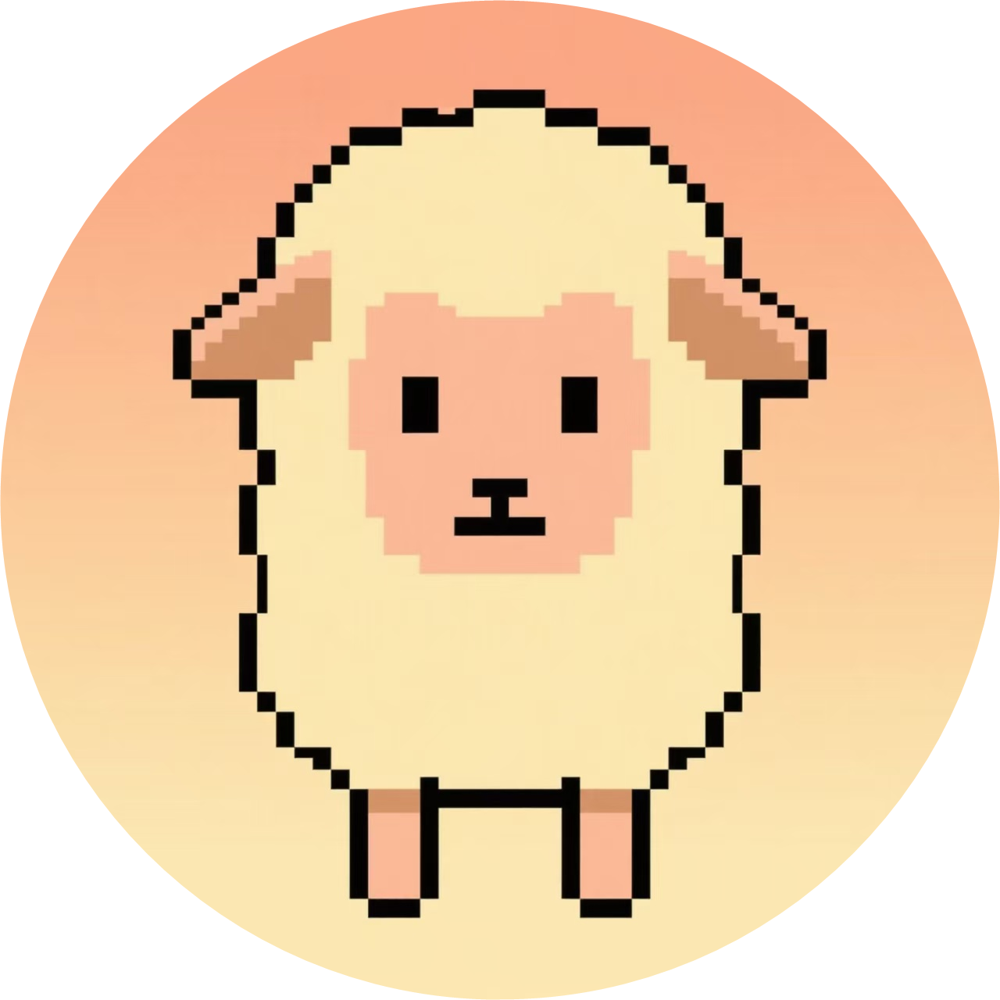

<div align="center">



# ValleyServer

**星露谷物语专用服务器**

[简体中文](README.md) | [English](README_en.md)

[](https://github.com/Lixeer/ValleyServer/releases) [](LICENSE) [](https://github.com/Lixeer/ValleyServer/stargazers)

</div>

---

## 这是什么

ValleyServer 让星露谷物语的农场在没有真人操作时也能持续运行，并提供一个可以直接联机的多人服务器。项目包含两条互不依赖的主线：

- **2.x — MOD + Docker**：在真实游戏客户端上运行自动化 MOD（自动睡觉、跳过剧情、关闭弹窗），配合 Docker 一键部署。**维护模式。**
- **3.x — 反编译 / mock 协议端**：不依赖游戏客户端，直接加载反编译程序集构建无 GUI 的原生无头服务器。**实验性。**

> [!NOTE]
> 两条主线的构建与运行都不需要 Steam 账号或 Steam 客户端。项目永久开源免费，作者未从中获得收益；如果你喜欢这个游戏，请支持正版。

## 该用哪个版本

| | 2.x（MOD + Docker） | 3.x（反编译 / mock 协议端） |
| :--- | :--- | :--- |
| 原理 | 真实游戏 + `SMAPI` + 自动化 MOD | 加载反编译程序集，用反射 / mock 驱动 |
| 状态 | 维护模式：仅修复性维护 | 实验性：不建议用于生产 |
| 适合谁 | 已在运行的存量服务器 | 尝鲜、研究多人协议、参与开发 |
| 优点 | 相比Steam联机或者p2p可独立长期运行 | 既有2.x的有点的同时，使用更方便，占用更低 |
| 文档 | [docs/v2](docs/v2/README.md) | [docs/v3](docs/v3/README.md) |

**选型建议**

- 想要**长期稳定运行**：2.x 仍可用但已冻结；也可以评估生态位相近的 [JunimoServer](https://github.com/stardew-valley-dedicated-server/server)。
- 想**尝鲜或参与 3.x 开发**：从 [3.x 文档](docs/v3/README.md) 开始。
- 完整的对比与决策路径：[版本指南](docs/version-guide.md)。

> [!IMPORTANT]
> 2.x 处于维护模式：不再接收功能增强、容器管理方案一类的合并请求，只修复崩溃与兼容性问题。已有部署可以继续使用，镜像与[部署手册](docs/v2/cookbook.md)继续保留。

## 快速开始

### 3.x（实验性）

从 [Releases](https://github.com/Lixeer/ValleyServer/releases) 下载 `ValleyServer-<平台>-x64.zip`，解压后直接运行可执行文件（自带 .NET 运行时）。首次启动生成 `config.json`，默认监听 `24642/udp`，控制台输入 `help` 查看指令。

构建方式、配置项与已知限制见 [3.x 文档](docs/v3/README.md)。

### 2.x（维护模式）

```sh
cd oneclick-script
bash ./run.sh
```

启动后访问 `http://<服务器IP>:5800` 进入 Web 界面，打开 VNC 页面输入连接密码（默认 `041041`）。MOD 目录首次为空，需要自行放入 `ALOS` 等 MOD。

端口、目录挂载与编排文件解读见 [Docker 部署手册](docs/v2/cookbook.md)。

## 文档导航

| 文档 | 内容 |
| :--- | :--- |
| [版本指南](docs/version-guide.md) | 2.x 与 3.x 的选型对比 |
| [2.x 文档](docs/v2/README.md) | 基于 MOD 的无人值守 + Docker：原理、快速开始、MOD 列表、常见问题 |
| [Docker 部署手册](docs/v2/cookbook.md) | 2.x 的容器化部署与编排文件解读 |
| [3.x 文档](docs/v3/README.md) | 反编译 / mock 协议服务端：构建、配置、进度与限制 |
| `Mods/*/README.md` | 各个 MOD 的功能与配置项说明 |

## 社区与支持

项目由社区持续维护与更新，欢迎提交 `issue` 与 `PR`。

> [!IMPORTANT]
> `issue` 区只接受与 MOD 相关的功能请求，不接受「请适配某管理面板 / 某种部署方式」这类请求：这类需求由社区驱动，不属于本仓库的范围。如果你已经有成熟的部署方案，欢迎提交 `PR` 把仓库链接加进文档。

| QQ 群组（#1–#3 已满） | [](https://qm.qq.com/q/XUzyb67T6C) | [%233-加入-blue)](https://qm.qq.com/q/vfn1YWMCRM) | [%232-加入-blue)](https://qm.qq.com/q/KhXvEqsw8g) | [%231-加入-blue)](https://qm.qq.com/q/Q8QaovnQWG) |
| :-: | :-: | :-: | :-: | :-: |

| QQ 频道（版本发布） | [](https://pd.qq.com/s/7gut1do04?b=5) |
| :-: | :-: |

## 致谢与友情链接

- [SMAPI](https://github.com/Pathoschild/StardewModdingAPI)：提供游戏注入与扩展机制
- [Stardew Valley](https://www.stardewvalley.net)：星露谷物语官方网站
- [stardew-multiplayer-docker](https://github.com/printfuck/stardew-multiplayer-docker)：星露谷物语多人游戏的 Docker 部署方案
- [JunimoServer](https://github.com/stardew-valley-dedicated-server/server)：另一个生态位相近的开源无人值守服务器方案

## 许可证

本仓库以 [Apache License 2.0](LICENSE) 分发。

`Mods/` 目录下的部分 MOD 为二次开发作品，遵循其原始协议——例如 [`ALOS`](Mods/ALOS/README.md) 基于 [perkmi/Always-On-Server-for-Multiplayer](https://github.com/perkmi/Always-On-Server-for-Multiplayer) 开发，采用 MIT 及附加协议，商业使用时请署名原仓库地址。`release` 页中打包的第三方 MOD，版权归各自作者所有。

## Star History

[](https://star-history.dera.page/#Lixeer/ValleyServer&Date)

## 贡献者

<a href="https://github.com/Lixeer/ValleyServer/graphs/contributors">
  
</a>

## 捐助支持

如果你喜欢这个项目，欢迎通过以下方式支持开发：


